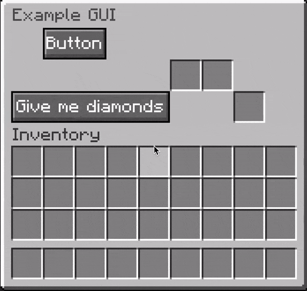

# praeter
Praeter is a Bukkit framework for using Resource Packs in plugins.

The project is still in its early stages! There is no download for the built
plugin jar, and the modules are not on any maven repository yet.

## praeter-core
The core module handles resource packs.

## praeter-gui
The `praeter-gui` module allows you to create custom graphical user interfaces.
Praeter provides an abstracted API for creating GUIs. Read the
[Getting Started](docs/praeter-gui/getting_started.md) page or the
[Creating a GUI](docs/praeter-gui/creating_a_gui.md) page.

Praeter handles creating the resource pack, sending that, creates the buttons,
including the text, handles item movements, etc. See the bottom of the
[Creating a GUI](docs/praeter-gui/creating_a_gui.md) page for the code to the
GIF above (it is only 33 lines of code!).