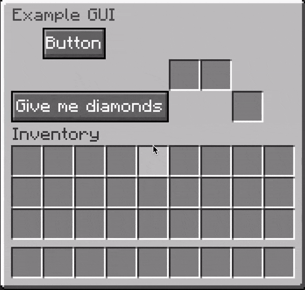

# Creating a GUI
Firstly, [add the `praeter-gui` dependency](getting_started.md).

Create a new class and extend `CustomGui`.

Create a static constant for your `CustomGuiType` by creating a builder, and
pass it to the constructor:
```java
public class ExampleGui extends CustomGui {

    public static final CustomGuiType TYPE = CustomGuiType.builder()
        .title(Component.text("Example GUI"))
        .height(3)
        .build();

    public ExampleGui() {
        super(TYPE);
    }
}
```

Give your GUI a title and a height. The height is measured in rows in a chest,
and must be between 1-6 (inclusive).

We must also register the GUI so praeter can prepare its textures during startup.
In your onEnable:
```java
@Override
public void onEnable() {
    PraeterGui.get().getGuiRegistry().register(
        ExampleGui.TYPE,
        new NamespacedKey(this, "example_gui"),
        this
    );
}
```

To create a GUI, construct a new instance of your class and call
`show(Player player)` to show the GUI to a player.
```java
Player player = ...;
ExampleGui gui = new ExampleGui();
gui.show(player);
```

You may show the same GUI to multiple players, and they will see the same GUI.

## Adding components
To add components to the GUI, we must create some static constants for each
component and add them to the `CustomGuiType.` This is required because praeter
must know, during startup, where components are and how they look to be able to
create the textures and other assets to include into the resource pack.

```diff
 public class ExampleGui extends CustomGui {
+    private static final Button BUTTON_1 = new Button("Button", 1, 0, 2, 1);
 
     public static final CustomGuiType TYPE = CustomGuiType.builder()
         .title(Component.text("Example GUI"))
         .height(3)
+        .add(BUTTON_1)
         .build();
 
     public ExampleGui() {
         super(TYPE);
     }
 }
```

As the component is a static constant, one instance will be created for all GUIs.
For each created `ExampleGui` we will get instances of what is known as the
component state. You can access this by calling the `get` method on the component
and passing in the `CustomGui` instance. For example, in the constructor:
```diff
 public class ExampleGui extends CustomGui {
     private static final Button BUTTON_1 = new Button("Button", 1, 0, 2, 1);
 
     public static final CustomGuiType TYPE = CustomGuiType.builder()
         .title(Component.text("Example GUI"))
         .height(3)
         .add(BUTTON_1)
         .build();
 
     public ExampleGui() {
         super(TYPE);
         
+        GuiComponent.State button1 = BUTTON_1.get(this);
+        button1.setOnClick(context -> {
+           context.playClickSound();
+       });
     }
 }
```

In this case, because `Button` has no extra state, the return type of `get` is
`GuiComponent.State`. For components that hold more complex state, like a `Slot`
holding the current item stack, or a `DisableableButton` holding whether it is
enabled or not, a subclass of `GuiComponent.State` will be returned. For example:

```java
private static final Slot SLOT_1 = new Slot(0, 1);
    
...

public ExampleGui() {
    super(TYPE);
    
    Slot.State slot1 = SLOT_1.get(this);
    slot1.getItemStack();
    slot1.setItemStack(...);
}
```

You can now add more components like `Button`, `DisableableButton`, and `Slot`,
attach click handlers, change state, etc. To update the GUI and render it again,
call `update();`.
```java
public class ExampleGui extends CustomGui {
    private static final Button BUTTON_1 = new Button("Button", 1, 0, 2, 1);
    private static final DisableableButton BUTTON_2 = new DisableableButton("Give me diamonds", 0, 2, 5, 1);
    private static final Slot SLOT_1 = new Slot(5, 1);
    private static final Slot SLOT_2 = new Slot(6, 1);
    private static final Slot SLOT_3 = new Slot(7, 2);

    public static final CustomGuiType TYPE = CustomGuiType.builder()
        .title(Component.text("Example GUI"))
        .height(3)
        .add(BUTTON_1, BUTTON_2, SLOT_1, SLOT_2, SLOT_3)
        .build();

    public ExampleGui() {
        super(TYPE);

        BUTTON_1.get(this).setOnClick(context -> {
            context.playClickSound();
            DisableableButton.State button2 = BUTTON_2.get(this);
            button2.setEnabled(!button2.isEnabled());
            update();
        });

        BUTTON_2.get(this).setOnClick(context -> {
            context.playClickSound();
            context.getPlayer().getInventory().addItem(new ItemStack(Material.DIAMOND));
        });

        BUTTON_2.get(this).setOnDisabledClick(context -> {
            context.getPlayer().playSound(context.getPlayer(), Sound.ENTITY_VILLAGER_NO, 1f, 1f);
        });
    }
}
```


Next up, you may want to [create your own components](creating_components.md).