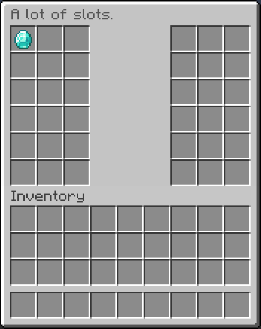
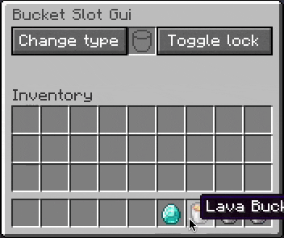
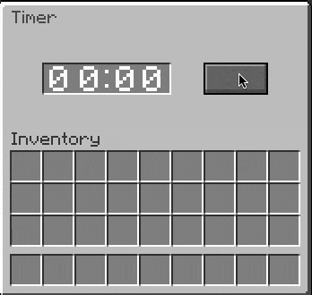

[Table of Contents](../table_of_contents.md)

# Examples


See the bottom of the [Creating a GUI](docs/praeter-gui/creating_a_gui.md) page
for the code.

<hr />



See the [Slots](./slots.md) page for the code.

<hr />



See the [Slots](./slots.md) page for the code.

<hr />



<details>
<summary>Code</summary>
<br>

```java
public class Timer extends Panel {
    private FontSequence[][] images;

    public Timer(int x, int y) {
        super(x, y, 4, 1);
    }

    @Override
    public void onSetup(RenderSetupContext context) throws IOException {
        // Draw the panel
        super.onSetup(context);

        // Draw the colon
        BufferedImage colon = new BufferedImage(2, 10, BufferedImage.TYPE_INT_ARGB);
        Graphics2D graphics = colon.createGraphics();
        graphics.setColor(Color.WHITE);
        graphics.fillRect(0, 0, 2, 2);
        graphics.fillRect(0, 8, 2, 2);
        context.getBackground().drawImage(colon, 35, 4);

        // Prepare digits
        this.images = new FontSequence[10][];
        for (int digit = 0; digit < 10; digit++) {
            String text = String.valueOf(digit);

            // Draw the digit
            int width = DrawTextUtils.getTextWidth(text, MinecraftFont.Font);
            int height = DrawTextUtils.getTextHeight(text, MinecraftFont.Font);
            BufferedImage image = new BufferedImage(width, height, BufferedImage.TYPE_INT_ARGB);
            DrawTextUtils.drawText(image, 0, 0, text, Color.WHITE, MinecraftFont.Font);

            // Scale it up to double
            BufferedImage scaledImage = new BufferedImage(width * 2, height * 2, BufferedImage.TYPE_INT_ARGB);
            scaledImage.createGraphics().drawImage(image.getScaledInstance(width * 2, height * 2, Image.SCALE_DEFAULT), 0, 0, null);

            // Save the digit texture
            ByteArrayOutputStream stream = new ByteArrayOutputStream();
            ImageIO.write(scaledImage, "png", stream);
            byte[] bytes = stream.toByteArray();

            // Write with a key instead of passing the BufferedImage to avoid duplicate
            // images if using multiple timers.
            NamespacedKey key = new NamespacedKey("praetertest", "gui/timer/" + digit + ".png");
            for (ResourcePack resourcePack : context.getResourcePacks()) {
                Path path = resourcePack.getTexturePath(key);
                Files.createDirectories(path.getParent());
                Files.write(path, bytes);
            }

            // Create the four FontSequences for the four possible positions of the digit
            FontSequence[] digitImages = new FontSequence[4];
            for (int digitPosition = 0; digitPosition < 4; digitPosition++) {
                int x = switch (digitPosition) {
                    case 0 -> 4;
                    case 1 -> 21;
                    case 2 -> 41;
                    case 3 -> 56;
                    default -> throw new RuntimeException();
                };
                FontSequence fontSequence = context.newFontSequence()
                    .drawImage(key, x, 2)
                    .build();
                digitImages[digitPosition] = fontSequence;
            }
            this.images[digit] = digitImages;
        }
    }

    @Override
    public GuiComponent.State createState() {
        return new State();
    }

    @Override
    public State get(CustomGui gui) {
        return (State) super.get(gui);
    }

    public class State extends GuiComponent.State {
        private int digit0;
        private int digit1;
        private int digit2;
        private int digit3;

        @Override
        public void onRender(RenderDispatcher renderDispatcher) {
            // The images field contains a two-dimensional array. The first dimension denotes
            // the digit [0-9], and the second dimension the position of the digit [0-3].
            renderDispatcher.render(images[digit0][0]);
            renderDispatcher.render(images[digit1][1]);
            renderDispatcher.render(images[digit2][2]);
            renderDispatcher.render(images[digit3][3]);
        }

        public void set(int digit0, int digit1, int digit2, int digit3) {
            this.digit0 = digit0;
            this.digit1 = digit1;
            this.digit2 = digit2;
            this.digit3 = digit3;
        }
    }
}
```

```java
public class TimerGui extends CustomGui {

    private static final Timer TIMER = new Timer(1, 1);
    private static final Button BUTTON = new Button("", 6, 1, 2, 1);

    public static final CustomGuiType TYPE = CustomGuiType.builder()
        .title(Component.text("Timer"))
        .height(3)
        .add(TIMER, BUTTON)
        .build();

    public TimerGui() {
        super(TYPE);

        BUTTON.get(this).setOnClick(context -> {
            int digit0 = (int) (Math.random() * 10);
            int digit1 = (int) (Math.random() * 10);
            int digit2 = (int) (Math.random() * 10);
            int digit3 = (int) (Math.random() * 10);
            TIMER.get(this).set(digit0, digit1, digit2, digit3);
            update();
        });
    }
}
```
</details>